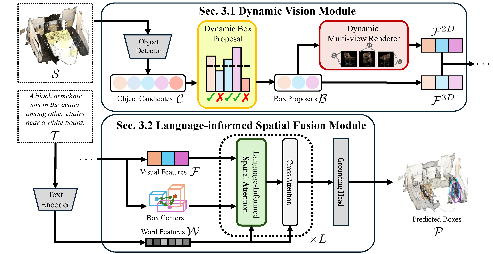

# Multi-Object 3D Grounding with Dynamic Modules and Language Informed Spatial Attention (D-LISA)

[Project Page](https://haomengz.github.io/dlisa) | [Paper](https://arxiv.org/abs/2410.22306)

This is the official implementation for our paper **Multi-Object 3D Grounding with Dynamic Modules and Language Informed Spatial Attention**, accepted in NeurIPS 2024.

## Overview


## Environment
``` bash
conda create -n dlisa python=3.10
conda activate dlisa

# install PyTorch 2.0.1 w/ CUDA 11.7
conda install pytorch==2.0.1 torchvision==0.15.2 torchaudio==2.0.2 pytorch-cuda=11.7 -c pytorch -c nvidia

# install PyTorch3D with dependencies
conda install -c fvcore -c iopath -c conda-forge fvcore iopath
conda install pytorch3d -c pytorch3d

# install MinkowskiEngine with dependencies
# you may want to downgrade pip to install MinkowskiEngine
conda install -c anaconda openblas
pip install -U git+https://github.com/NVIDIA/MinkowskiEngine -v --no-deps \
--install-option="--blas_include_dirs=${CONDA_PREFIX}/include" --install-option="--blas=openblas"

# install Python libraries
pip install .

# install CUDA extensions
cd dlisa/common_ops
pip install .
```

## Data Preparation
Please follow the Data Preparation section [here](https://github.com/3dlg-hcvc/M3DRef-CLIP?tab=readme-ov-file#data-preparation).


## Training, Inference and Evaluation
```shell
# log in to WandB
wandb login

# train a model with the pre-trained detector, using predicted object proposals
python train.py data={scanrefer/nr3d/multi3drefer} experiment_name={any_string} +detector_path=checkpoints/PointGroup_ScanNet.ckpt

# test a model from a checkpoint and save its predictions
python test.py data={scanrefer/nr3d/multi3drefer} experiment_name={checkpoint_experiment_name} data.inference.split={train/val/test} ckpt_path={ckpt_file_path}

# evaluate predictions 
python evaluate.py data={scanrefer/nr3d/multi3drefer} experiment_name={checkpoint_experiment_name} data.evaluation.split={train/val/test}
```

### Training scripts
This project is built on the platform with CentOS 7 and Slurm as the batch scheduler for resource and job management. We provide the training scripts in ```scripts/``` directory for training in multiple jobs:
```
bash scripts/train.sh
```
See ```scheduled_job``` and ```resume``` parameters in ```config/global_config.yaml``` and ```train.py``` for multi-job training. Please modify the scripts accordingly for your own envirnment and resources.


## Checkpoint
Our pre-trained model can be downloaded from [Google Drive](https://drive.google.com/file/d/1_oiXDvIvBrLkfFWAVHz_17baxpwFjsMC/view?usp=sharing). Run following commands for testing:
```
python test.py data=multi3drefer data.inference.split=val ckpt_path=path/to/checkpoint/best.ckpt
python evaluate.py data=multi3drefer
```
CheckPoint performance:

| Split | ZT w/ D | ZT w/o D | ST w/ D | ST w/o D | MT   | Overall |
|:------|:--------|:---------|:--------|:---------|:-----|:--------|
| Val   | 41.3    | 81.8     | 42.4    | 67.3     | 51.0 | 51.1    |       
                                                                        

## Reference
If you find our work or any of our materials useful, please cite our paper:
```
@inproceedings{zhang2024dlisa,
    title={Multi-Object 3D Grounding with Dynamic Modules and Language-Informed Spatial Attention}, 
    author={Haomeng Zhang and Chiao-An Yang and Raymond A. Yeh},
    booktitle={Proc. NeurIPS},
    year={2024}
}
```
     
## Acknowledgement
We thank [M3DRef-CLIP](https://github.com/3dlg-hcvc/M3DRef-CLIP) for open sourcing their implementation, which we referred to during the development of this codebase.
